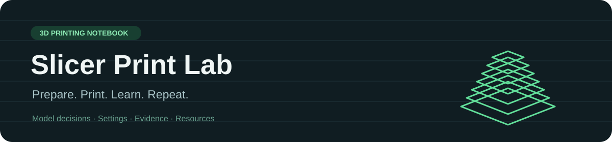

**Better prints through careful preparation and real results.**

[Workflow](docs/workflow.md) · [Print journal](prints/README.md) · [Resources](docs/resources.md) · [Codex skill](skills/bambu-a1-print-quality/SKILL.md)

A growing notebook for preparing complicated models in Bambu Studio on a **Bambu Lab A1**. It brings together a reusable Codex skill, recorded settings, and observations from actual prints so that each successful experiment improves the next one.

## Start here

1. Open your model in Bambu Studio and confirm the printer, physical nozzle, material, and build plate.
2. Use the [preparation workflow](docs/workflow.md), or ask Codex: **“Use $bambu-a1-print-quality to prepare this model.”**
3. Inspect the slice, save the local 3MF, and review the estimated time and material.
4. After printing, use the [print record template](templates/print-record.md) to capture what worked and what needs changing.
5. Commit the record and relevant settings. Promote a result to **print-verified** only after inspecting the physical print.

## Current notebook

| Record | Setup | Evidence | Outcome |
|---|---|---|---|
| [Sculpted figure lower body](prints/2026-10-04-figure-lower-body.md) | A1 · 0.4 mm · Generic PLA profile · 0.12 mm layers | Slicer-verified | Physical result pending |

The first entry records a completed slice, not a successful physical print. There are currently **no print-verified recipes** in this notebook.

## What lives here

| Folder | Purpose |
|---|---|
| [`skills/`](skills/bambu-a1-print-quality/SKILL.md) | Reusable instructions for Codex and Bambu Studio |
| [`prints/`](prints/README.md) | Print decisions, observations, failures, and improvements |
| [`settings/`](settings/README.md) | Small, readable settings snapshots linked to records |
| [`docs/`](docs/workflow.md) | Preparation workflow and curated resources |
| [`templates/`](templates/print-record.md) | A consistent way to record new experiments |

## Use the skill

Copy `skills/bambu-a1-print-quality/` into your Codex skills directory, usually `~/.codex/skills/`. The skill relies on Windows computer-use capabilities to operate Bambu Studio; the Markdown workflow is usable manually too.

Your own skill installation is already available as `$bambu-a1-print-quality`. The repository copy is its versioned source. Copy reviewed updates into the local skills directory when you want to use a new version.

## Keep experiments useful

- Record the real filament brand/type and slicer version when known; a selected profile does not prove which spool is loaded.
- Link every settings snapshot to its geometry and outcome. A good figure recipe may be wrong for a functional bracket.
- Keep failures: a clear failure photo and one targeted change can be more useful than a settings list.
- State what changed and why; compare prints under similar conditions.
- Keep downloaded models, printer credentials, machine identifiers, and local paths out of public commits.

## Scope

This repository contains original notes and workflow instructions. Model files and full 3MF projects stay local unless their redistribution rights and contents have been checked. Settings snapshots are **not importable Bambu Studio presets**. Preparing a project does not start a print.

This is an independent personal project, not an official Bambu Lab repository. Resource descriptions are summaries; linked documentation belongs to its respective authors.
